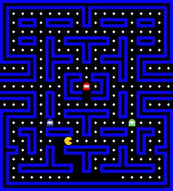
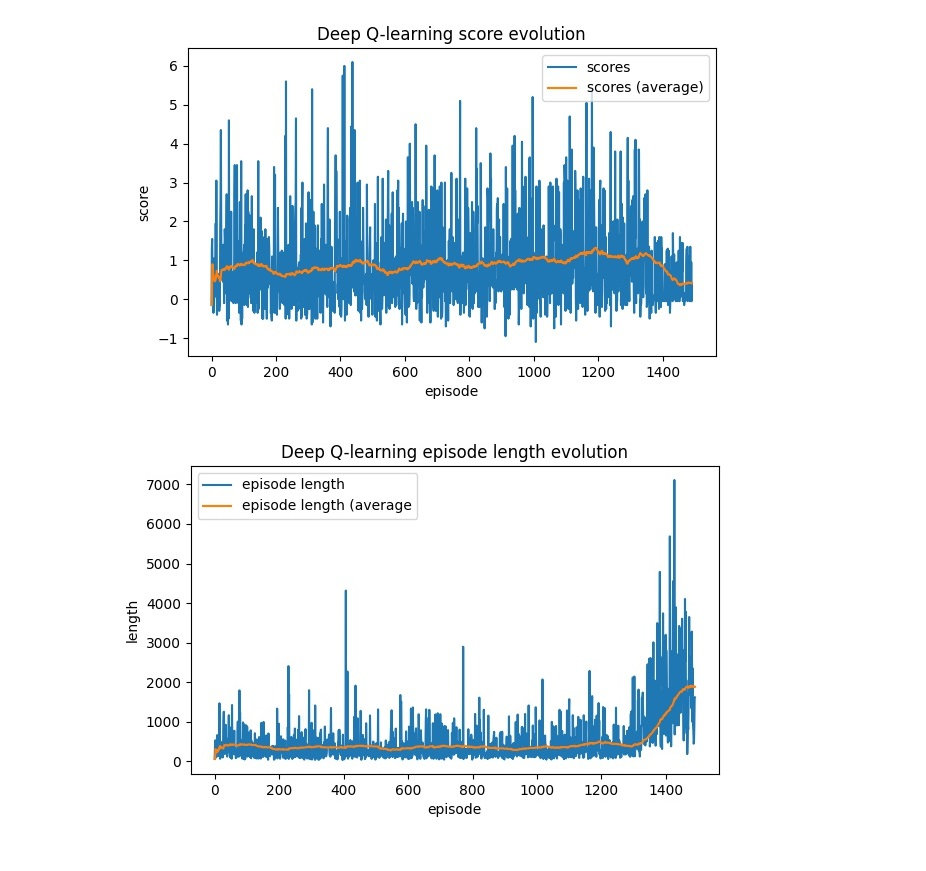
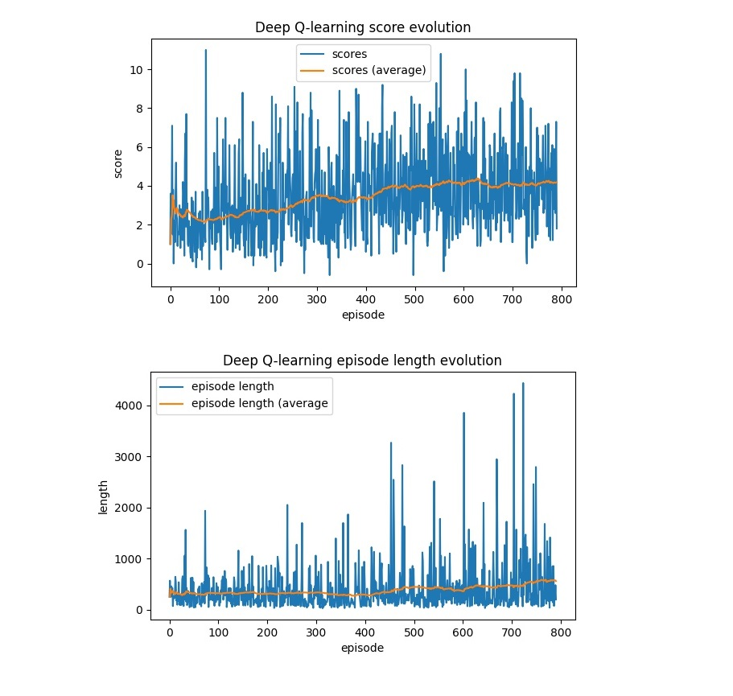

# Pac-Man-RL
An exploration of different Reinforcement Learning methods for playing Pac-Man.

## Description

This repo implements a simplified version of Pac-Man as a gym environment and trains a DQN agent to eveolve withing the environment.

The implementation of the environment is made entirely in numpy for easy interaction.

Currently the environment contains the following:

* **Pac-Man:** DQN agent.
* **Ghosts:** three ghosts following a random policy and can inflict damage to the Pac-Man.
* **Dots:** are distributd over the map and provide the Pac-Man with positive rewards when they are eaten.

The agent receives rewards on two occasions:
* When coming in contact with a ghost, in which case the episode terminates. Let's call this reward $w_1$.
* When eating a dot, let's call this reward $w_2$.

The ratio of $w1 \over w_2$ therefore detemines the behavior of the agent during training.

## Architecure

We experimented with two different models, the first is a feedforward fully connected network with one hidden layer and a hidden dimension of 512.

The second is a more convolutional netqwork with elu activation and batch norm.

We retained the first model for experiments.

## Experiments

* $w_1 = -1$ and $w_2 = 0.05$ - The agent learns to avoid the ghosts while not giving a particular importance to eating the dots.

* $w_1 = 0.2$ and $w_2 = -1$ - The agent learns to eat more dots while the average episode length slowly increases.

